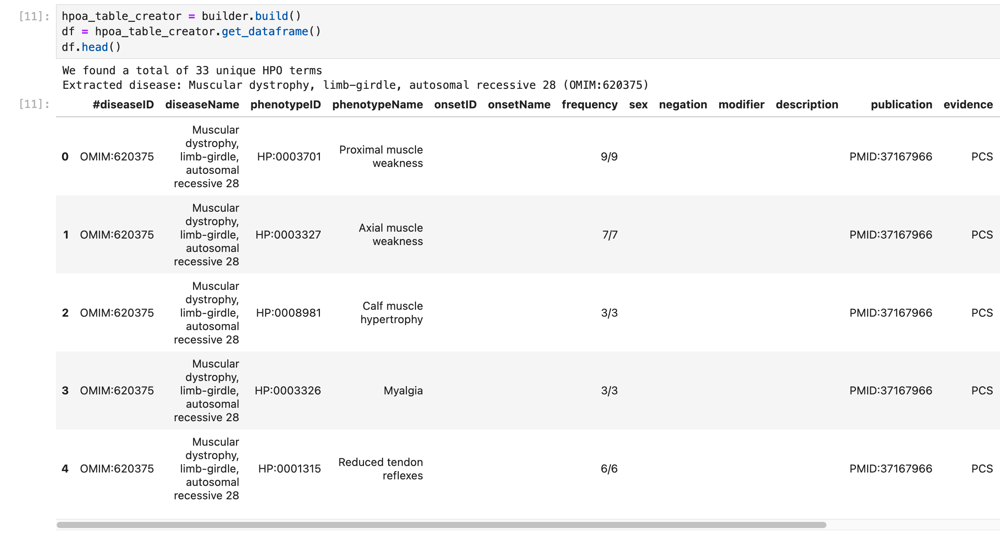

# HPOA Editing

The HPO team creates one HPOA file for each annotated disease. We are in the process of converting our entire annotation pipeline to be based on phenopackets, and we would like to generate the HPOA files from collections of phenopackets (because essentially all existing HPO-based software uses the file phenotype.hpoa, which is generated from the individual HPOA files).

This document explains how to create HPOA files. Several examples are available on the phenopacket-store website, including:

- [ESAM](https://github.com/monarch-initiative/phenopacket-store/blob/main/notebooks/ESAM/ESAM_Lecca_2023.ipynb)


### Input data

HPOA files can be generated from a collection of phenopackets. Each phenopacket should describe an individual with the same disease (identical OMIM, ORPHA, or MONDO identifier). If you are starting from a directory with a collection of phenopackets (JSON files), then ingest the files as follows.

```python title="Importing phenopackets from JSON files"
from pyphetools.visualization import *
ingestor = PhenopacketIngestor(indir="phenopackets")
ppkt_d = ingestor.get_phenopacket_dictionary()
ppkt_list = list(ppkt_d.values())
```

If you are starting with pyphetools Individual objects, then create phenopackets as follows (note: you will need to have created a pyphetools MetaData object to create the individual list).


```python title="Importing phenopackets from pyphetools Individual objects"
ppkt_list = [i.to_ga4gh_phenopacket(metadata=metadata) for i in individuals]
```

We recommend that you use the quality control and visualization facilities offered by pyphetools before continuing. See [validation](../user-guide/validation.md).

### HPOA Table Builder

The builder object can be used to create the HPOA annotations. There are two ways to initialized the builder.

```python title="Initializing the builder from a phenopacket list"
builder = HpoaTableBuilder(phenopacket_list=ppkt_list)
```
It is also possible to create a builder object by providing the path to the directory of phenopackets.
```python title="Initializing the builder from from JSON files"
builder = HpoaTableBuilder(indir="phenopackets")
```


### Mode of inheritance
In the HPOA annotation model, we regard the mode of inheritance as certain knoweldge that does not receive a frequency or does not need to be specified for each publication (exception: rare diseases with multiple modes of inheritance). In this case, the disease is listed as autosomal dominant in OMIM and in both publications. We curate this using one of the PMIDs (generally, the first to report the disease) as follows.

```python title="specifying mode of inheritance"
PMID = "PMID:123" # enter the PMID of an article that specificies the mode of inheritance.
builder.autosomal_recessive(PMID)
```

### Visualizing the annotations

We can bow build the table creator and retrieve the pandas dataframe with all of the annotations.

```python title="building the table creator"
hpoa_table_creator = builder.build()
df = hpoa_table_creator.get_dataframe()
df.head()
```

This produces a table like this:

<figure markdown>
{ width="1000" }
<figcaption>Validation Results.
</figcaption>
</figure>

### Saving to file

We save the HPOA files for each disease with file names such as ``OMIM-620375.tab``. The can be done with the following command

```python title="writing the HPO file"
hpoa_table_creator.write_data_frame()
```

This file should then be merged with the HPOA repository (task for the HPO team).

### API

See

- [HpoaTableCreator](../api/visualization/hpoa_table_creator.md)