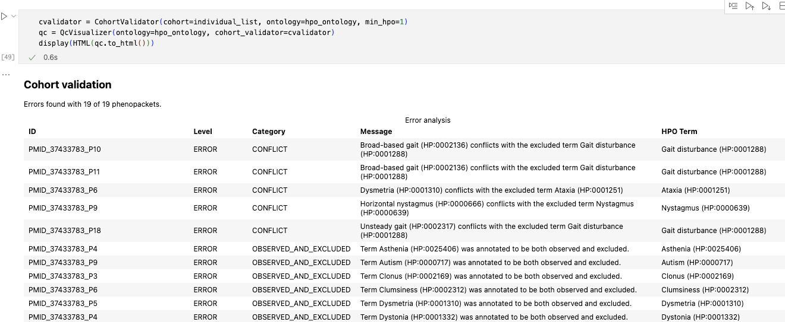

# Validation


There are many types of errors that can occur in phenopackets. The Java application [phenopacket-tools](https://github.com/phenopackets/phenopacket-tools) is a general purpose app for validating and working with phenopackets. pyphetools provides a limited number of commands to check validity of the generated phenoopackets that can be conveniently used as a part of notebooks that create phenopackets.

Commonly encvountered errors include redundancy and inheritance conflicts.

### Mistaken HPO identifiers or labels

Sometimes a phenopacket may contain an obsolete HPO id or a spelling error in the label.

### Redundant terms

If an individual is found to have [Nuclear cataract(HP:0100018)](https://hpo.jax.org/app/browse/term/HP:0100018){:target="\_blank"}, which means an opacity that develops in the nucleus of the lens of the eye, then the individual always can be said to have a   [Cataract (HP:0000518)](https://hpo.jax.org/app/browse/term/HP:0000518){:target="\_blank"}, which refers to an opacity anywhere in the lens of the eye. This is because of the so-called true-path rule of ontologies, according to which if an HPO term is used to annotate an individual, then the parent of that term and all of the ancestors of that term must also apply. In this case, Cataract is a grand-parent of Nuclear cataract.

Because of this, if we have annotated with [Nuclear cataract(HP:0100018)](https://hpo.jax.org/app/browse/term/HP:0100018){:target="\_blank"}, it is not necessary to annotate with [Cataract (HP:0000518)](https://hpo.jax.org/app/browse/term/HP:0000518){:target="\_blank"}, because it is implicitly true.

We therefore recommend that only the most specific HPO term be used for a time point.

### Conflicting terms

In some datasets we have seen, a patient is annotated with a specific term in an organ, but also indicate that abnormalities have been excluded at a higher level. For instance, we might see [Ventricular septal hypertrophy (HP:0005144)](https://hpo.jax.org/app/browse/term/HP:0005144) but also excluded [Abnormal heart morphology (HP:0001627)](https://hpo.jax.org/app/browse/term/HP:0001627).


## QC with pyphetools.
We recommned checking all generated phenopackets with the following steps. First obtain the list of [Individual](../api/creation/individual.md){:target="_blank"} objects.
Pass this list together with a reference to the HPO to a [CohortValidator](../api/validation/content_validator.md){:target="_blank"} object.
To display the results of validation, use a [QcVisualizer](../api/visualization/qc_visualizer.md){:target="_blank"}.

The QcVisualizer can show either a list of all issues with the *to_html* method or a summary of issues with the *to_summary_html* method.

```python title="Generating GA4GH phenopackets from a pyphetools individual list"
individuals = encoder.get_individuals()
cvalidator = CohortValidator(cohort=individuals, ontology=hpo_ontology, min_hpo=1)
qc = QcVisualizer(ontology=hpo_ontology, cohort_validator=cvalidator)
display(HTML(qc.to_html()))
# alternatively: display(HTML(qc.to_summary_html()))
```

This will either display a message that no errors were found, or will show a table as in the following figure.

<figure markdown>
{ width="1000" }
<figcaption>Validation Results.
</figcaption>
</figure>

There are some kinds of error that need to be corrected in the notebook, such as malformed HPO ids or labels. Others can be corrected automatically, such as
redudant terms.

| Category | Explanation | Autocorrect? |
|:---------|:------------|:-------------|
| REDUNDANT| HPO term and ancestor term both reported as observed | Yes (redundant ancestor term removed) |
|CONFLICT| HPO term observed and ancestor term excluded |Yes (conflicting  ancestor term removed) |
|INSUFFICIENT_HPOS | Individual does not have at least threshold number of HPOs | Yes, individual removed from cohort |
|  INCORRECT_ALLELE_COUNT | number of alleles unexpected given mode of inheritance | No |
| INCORRECT_VARIANT_COUNT | number of variants unexpected given mode of inheritance | No |
|   MALFORMED_ID | HPO id (e.g., HP:0001234) obsolete or incorrect | No |
|   MALFORMED_LABEL | Label obsolete or incorrect | No |
|    NOT_MEASURED | HPO term reported as not measure | Yes, not measured term removed |
|   OBSERVED_AND_EXCLUDED | Same HPO term reported as observed and excluded | No |


The issues that are shown as Autocorrect = Yes will be fixed automatically with the following command.


```python title="Getting individual objects with no syntax or ontology errors"
individuals = cvalidator.get_error_free_individual_list()
```

Issues that cannot be fixed with Autocorrect will lead to the individual being removed from the cohort and usually should be fixed in the notebook before proceeding.


If desired, it is possible to double-check that these individuals have no errors by doing another round of checks with the CohortValidator.